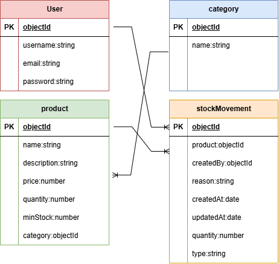

# 📦 Inventory Management System

A web-based Inventory Management System that allows users to manage products, categories, and stock movements in one place.

The system provides a simple way to keep track of available stock, monitor low-stock products, and record stock coming in and going out.

## 🛠️ Technologies Used
1. Node.js
2. Express.js
3. MongoDB
4. Mongoose
5. EJS
6. HTML
7. CSS
8. JavaScript

## User Stories
1. As a user, I want to create an account so that I can access the inventory system.
2. As a user, I want to sign in so that I can manage the inventory.
3. As a user, I want to view the dashboard so that I can quickly understand the current inventory status.
4. As a user, I want to view all products so that I can see what is currently in the inventory.
5. As a user, I want to add a product so that I can add new items to the inventory.
6. As a user, I want to view product details so that I can see information about a specific product.
7. As a user, I want to edit a product so that I can update incorrect or outdated information.
8. As a user, I want to delete a product so that I can remove products that are no longer needed.
9. As a user, I want to organize products by category so that the inventory is easier to manage.
10. As a user, I want to add stock so that I can record new inventory.
11. As a user, I want to remove stock so that I can record inventory leaving the system.
12. As a user, I want to view stock movement history so that I can see changes made to product quantities.

## Database Design

The application uses four main models:

## Database Design

### User

| User |
|------|
| `_id` |
| `username` |
| `email` |
| `password` |

### Product

| Product |
|---------|
| `_id` |
| `name` |
| `description` |
| `price` |
| `quantity` |
| `minimumStock` |
| `category` |

### Category

| Category |
|----------|
| `_id` |
| `name` |

### StockMovement

| StockMovement |
|---------------|
| `_id` |
| `product` |
| `createdBy` |
| `type` |
| `quantity` |
| `reason` |
| `createdAt` |
| `updatedAt` |

### Relationships
One user can create many stock movements.
One product can have many stock movements.
One category can contain many products.

## Routes

### Authentication Routes

| Method | Route | Description |
|--------|-------|-------------|
| GET | `/` | Home page with Sign In form |
| GET | `/auth/sign-up` | Sign Up form |
| POST | `/auth/sign-up` | Create a new user account |
| POST | `/auth/sign-in` | Sign in a user |
| GET | `/auth/sign-out` | Sign out the current user |

### Product Routes

| Method | Route | Description |
|--------|-------|-------------|
| GET | `/dashboard` | View inventory dashboard |
| GET | `/products` | List all products |
| GET | `/products/new` | New product form |
| POST | `/products` | Create a product |
| GET | `/products/:id` | View product details |
| GET | `/products/:id/edit` | Edit product form |
| PUT | `/products/:id` | Update product |
| DELETE | `/products/:id` | Delete product |

### Stock Routes

| Method | Route | Description |
|--------|-------|-------------|
| POST | `/products/:id/stock/in` | Add stock |
| POST | `/products/:id/stock/out` | Remove stock |
| GET | `/stock` | View stock movement history |

### Category Routes

| Method | Route | Description |
|--------|-------|-------------|
| POST | `/categories` | Create a category |
| DELETE | `/categories/:id` | Delete a category |

## Features
1. User registration and authentication
2. Dashboard with inventory statistics
3. Full CRUD functionality for products
4. Product categories
5. Product quantity management
6. Add stock
7. Remove stock
8. Stock movement history
9. Low-stock identification
10. Out-of-stock identification
11. Product details