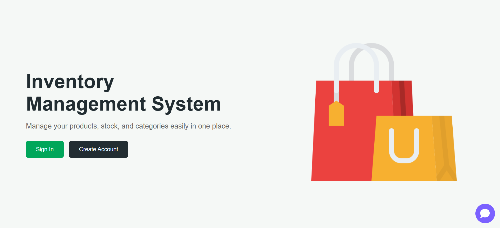
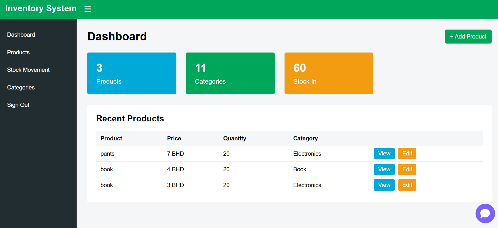
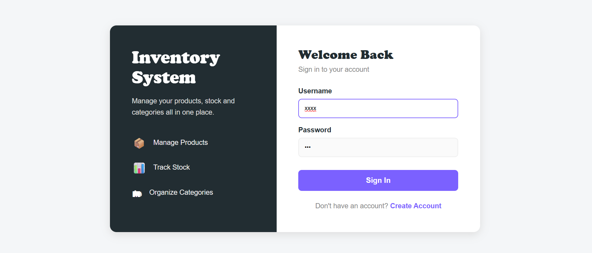
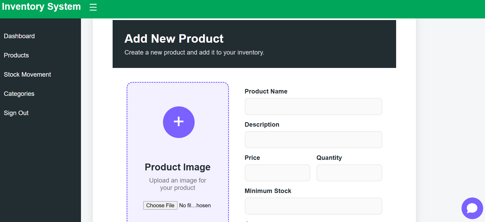
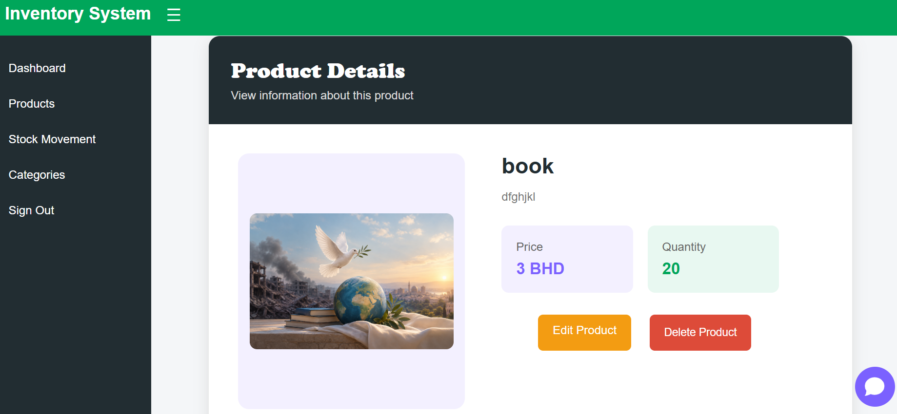
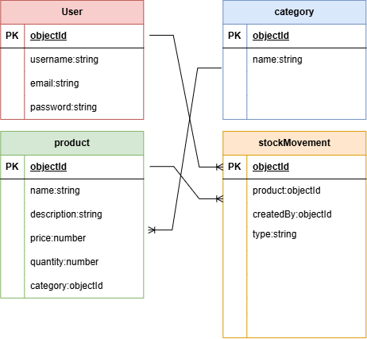

# 📦 Inventory Management System

A web-based Inventory Management System that allows users to manage products, categories, and stock movements in one place.

The system provides a simple way to keep track of available stock, monitor low-stock products, and record stock coming in and going out.

## 🛠️ Technologies Used
1. Node.js
2. Express.js
3. MongoDB
4. Mongoose
5. EJS
6. HTML
7. CSS
8. JavaScript

## User Stories
1. As a user, I want to create an account so that I can access the inventory system.
2. As a user, I want to sign in so that I can manage the inventory.
3. As a user, I want to view the dashboard so that I can quickly understand the current inventory status.
4. As a user, I want to view all products so that I can see what is currently in the inventory.
5. As a user, I want to add a product so that I can add new items to the inventory.
6. As a user, I want to view product details so that I can see information about a specific product.
7. As a user, I want to edit a product so that I can update incorrect or outdated information.
8. As a user, I want to delete a product so that I can remove products that are no longer needed.
9. As a user, I want to organize products by category so that the inventory is easier to manage.
10. As a user, I want to add stock so that I can record new inventory.
11. As a user, I want to remove stock so that I can record inventory leaving the system.
12. As a user, I want to view stock movement history so that I can see changes made to product quantities.

## Screenshots

## Database Design

The application uses four main models:

## Database Design

### User

| User |
|------|
| `_id` |
| `username` |
| `password` |

### Product

| Product |
|---------|
| `_id` |
| `name` |
| `description` |
| `price` |
| `quantity` |
| `category` |

### Category

| Category |
|----------|
| `_id` |
| `name` |

### StockMovement

| StockMovement |
|---------------|
| `_id` |
| `product` |
| `createdBy` |
| `type` |

### Relationships
One user can create many stock movements.
One product can have many stock movements.
One category can contain many products.

## Routes

### Authentication Routes

| Method | Route | Description |
|--------|-------|-------------|
| GET | `/` | Home page with Sign In form |
| GET | `/auth/sign-up` | Sign Up form |
| POST | `/auth/sign-up` | Create a new user account |
| POST | `/auth/sign-in` | Sign in a user |
| GET | `/auth/sign-out` | Sign out the current user |

### Product Routes

| Method | Route | Description |
|--------|-------|-------------|
| GET | `/dashboard` | View inventory dashboard |
| GET | `/products` | List all products |
| GET | `/products/new` | New product form |
| POST | `/products` | Create a product |
| GET | `/products/:id` | View product details |
| GET | `/products/:id/edit` | Edit product form |
| PUT | `/products/:id` | Update product |
| DELETE | `/products/:id` | Delete product |

### Stock Routes

| Method | Route | Description |
|--------|-------|-------------|
| POST | `/stock/new` | Stock movement form |
| POST | `/stock` | Create a stock movement |
| GET | `/stock` | View stock movement history |

### Category Routes

| Method | Route | Description |
|--------|-------|-------------|
| GET | `/categories` | View all categories |
| GET | `/categories/new` | New category form |
| POST | `/categories` | Create a category |
| GET | `/categories/:id/edit` | Edit category form |
| PUT | `/categories/:id` | Update a category |
| DELETE | `/categories/:id` | Delete a category |

### Dashboard Route
| Method | Route | Description |
|--------|-------|-------------|
| GET | `/dashboard` | View the inventory dashboard |

## Features
1. User registration and authentication
2. Landing page
3. Inventory dashboard
4. Dashboard statistics with animated counters
5. Full CRUD functionality for products
6. Product details
7. Product images
8. Product categories
9. Admin-only category management
10. Add stock
11. Remove stock
12. Stock movement history
13. Sign in and sign out
14. Responsive and styled user interface
15. Product card hover effects
16. Product image zoom effect

### AI chatbot for answering general questions about the website
🤖 AI Chatbot

The website includes an AI chatbot that helps users with general questions about the Inventory Management System.

The chatbot can provide information about:

- How to use the website
- Products
- Categories
- Stock movements
- Dashboard
- User accounts
- Administrator features

The AI chatbot was created and embedded using Chatling.

Chatling: https://chatling.ai/